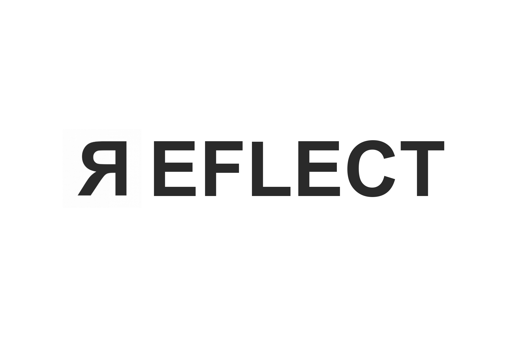

Middleware for interacting with wearable devices

## Setup and Run

1. [Setup cluster](config) (Kubernetes or Minikube)

2. Functionality is delivered by a number of individual components, each of which is hosted in this monorepo:

    1. Deploy [user registration service](user)
    2. Deploy [device data collection functions](device)
    3. Deploy [data conversion functions](data)
    4. Deploy [API service](api) to enable data to be retrieved

## Contributing

Please read [CONTRIBUTING.md](CONTRIBUTING.md) for details on our code of conduct, and the process for submitting pull requests to us.

## Versioning

We use [SemVer](http://semver.org/) for versioning. For the versions available, see the [tags on this repository](https://github.com/kclreflect/wearables/tags).

## Authors

Product as a part of the [REFLECT project](https://reflectproject.co.uk)

## License

This project is licensed under the MIT License - see the [LICENSE](LICENSE) file for details.

## Acknowledgments

* [CONSULT](https://consultproject.co.uk).
